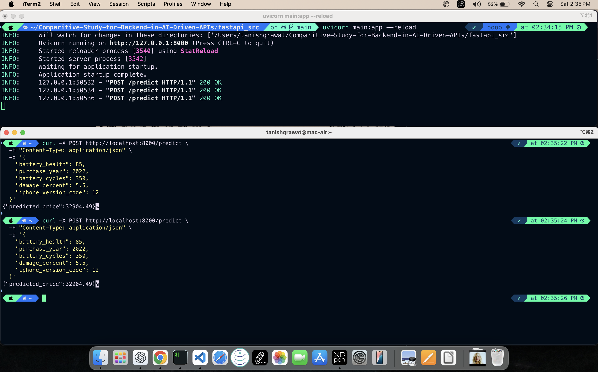
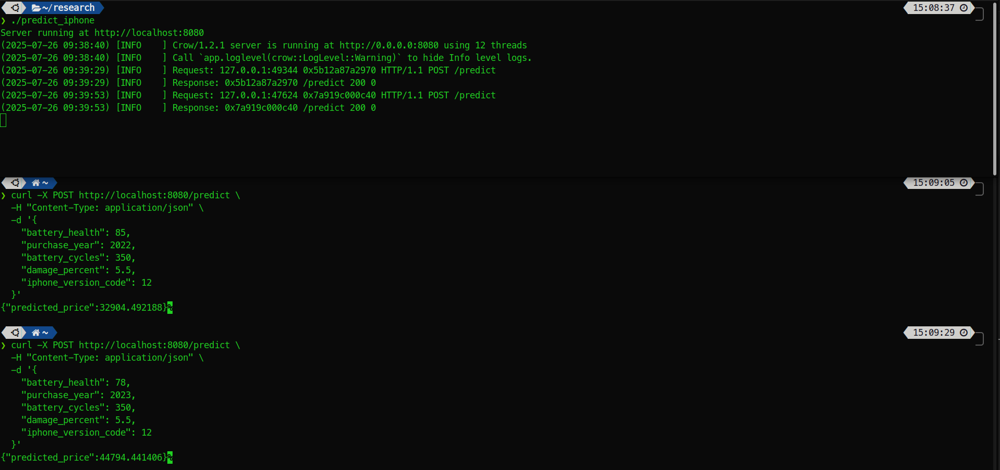
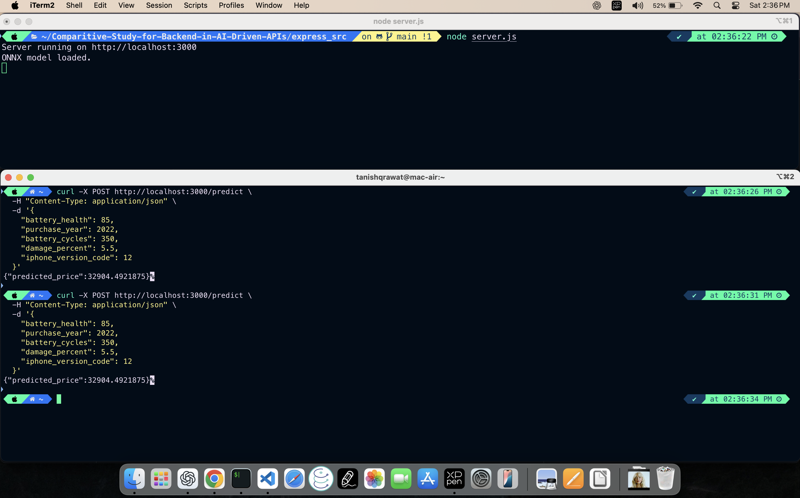
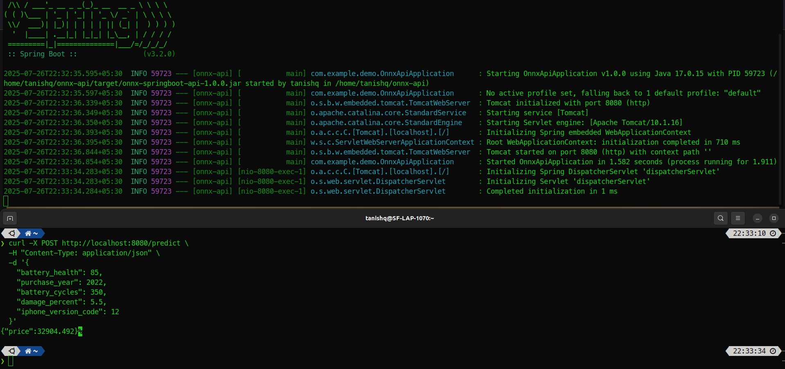

<div align="center">
<h1>Comparative Study for Backend in AI-Driven APIs</h1> 
    
<i>Benchmark Faster, Innovate Smarter, Lead the Future</i><br></br>


    


</div>

### Introduction
Conducted a comparative study of modern back-end frameworks and languages, including Python, C++, Java, and Node.js, for serving AI-driven APIs. Using a real-world use case of predicting second-hand iPhone prices, I implement and benchmark inference APIs built with each backend. I evaluate them on multiple metrics, including latency, throughput, memory usage, and developer experience.

### Programming Languages & Frameworks
<ul>
<li> <b>Python</b> - FastAPI </li>
<li> <b>NodeJS</b> - Express </li>
<li> <b>C++</b> - Crow </li>
<li> <b>Java</b> - Spring Boot </li>
</ul>

<hr>

### How to set up FastAPI Environment
Execute the following commands to install dependencies
1. ``` pip install fastapi uvicorn python-dotenv jinja2 requests ```
2. ``` pip install pandas scikit-learn onnx onnxruntime ```

Execute the below command to start the FastAPI Server
1. ``` cd fastapi_src ``` 
2. ``` uvicorn main:app --reload ```
<br></br>

<hr>

### How to set up C++ Environment

1. ``` cd cpp_src ``` \
Now you will see 2 zip files [They are linux/mac based libraries, for windows you can find them on github] - asio.zip and onnxruntime-linux-x64-1.20.0.zip, You need to unzip them
2. ``` unzip asio.zip ; unzip onnxruntime-linux-x64-1.20.0.zip ```
You can also directly execute and start the server by
3. ``` ./predict_iphone ``` \
Or you can compile the <b>main.cpp</b> on your system. For that, you need to set 2 PATH variables
```
export ONNX_RUNTIME_DIR="onnxruntime-linux-x64-1.20.0" #You can also give an absolute path
export ONNX_LIB_PATH="onnxruntime-linux-x64-1.20.0/lib" #You can also give an absolute path

g++ main.cpp -o predict_iphone -std=c++17 \
    -I${ONNX_RUNTIME_DIR}/include \
    -I. \
    -Iasio/asio/include \
    -L${ONNX_LIB_PATH} \
    -lonnxruntime \
    -Wl,-rpath,${ONNX_LIB_PATH} \
    -pthread
```
To send a request using cURL you can use the following command
```
curl -X POST http://localhost:8080/predict \
    -H "Content-Type: application/json" \
    -d '{
        "battery_health": 90,
        "purchase_year": 2022,
        "battery_cycles": 300,
        "damage_percent": 15,
        "iphone_version": "iPhone 15"
    }'
```
<br></br>

<hr>

### How to set up NodeJS Environment
1. Install all the required packages
   ```
    npm install express body-parser onnxruntime-node
   ```
2. To run the server, execute the following command
   ```
    node server.js
   ```
3. To test the /predict endpoint, execute the following command.
   ```
   curl -X POST http://localhost:3000/predict \
   -H "Content-Type: application/json" \
   -d '{
        "battery_health": 85,
        "purchase_year": 2022,
        "battery_cycles": 350,
        "damage_percent": 5.5,
        "iphone_version_code": 12
   }'
   ```
<br></br>

<hr>

### How to set up Java Environment
1. Make sure you have Java 17 and Maven installed
   ```
    brew install openjdk@17 #For Mac
    sudo apt install openjdk@17 #For Linux

    brew install maven #For mac
    sudo apt install maven #For Linux
   ```
2. Execute the below command to generate the JAR file, located in target/
    ```
    mvn clean install
    ```
3. Execute the below command to execute the Spring Boot application
    ```
    java -jar target/{app_name}-0.0.1-SNAPSHOT.jar #replace app_name with your directory name
    ```
4. In a separate terminal, execute the below cURL command to test the endpoint
    ```
    curl -X POST http://localhost:8080/predict \
   -H "Content-Type: application/json" \
   -d '{
        "battery_health": 85,
        "purchase_year": 2022,
        "battery_cycles": 350,
        "damage_percent": 5.5,
        "iphone_version_code": 12
   }'
    ```
<br></br>

<hr>
